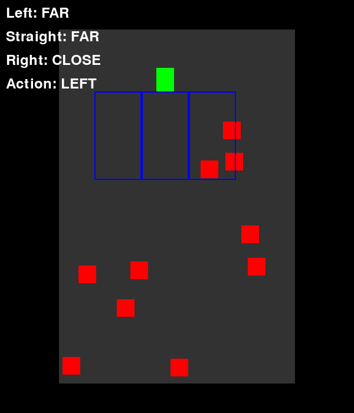
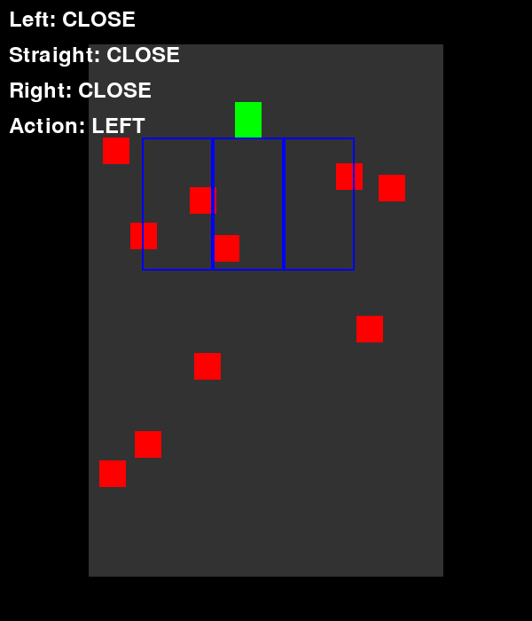

# gcoder — Car Race RL: SARSA vs Q-learning

A small reinforcement learning project: a car learns to drive down a road full of
obstacles using **SARSA** and **Q-learning**. Rendered with `pygame`.

## Environment

`env.py` defines `CarWorld`, a top-down driving world:

- **Road**: the car starts at the top of a vertical road (600×700 window) and
  always moves forward; only the horizontal position changes with the action.
- **Obstacles**: 10 red rectangles scattered on the road.
- **Car** (green): moves left / straight / right, and forward every step.

### State space

The car has 3 sensors (left, straight, right), each returning whether an
obstacle is `CLOSE` (0) or `FAR` (1) within its detection range:

```
state = [left, straight, right]   # each ∈ {0, 1}  →  2³ = 8 states
```

Each state is mapped to an id with `state_id = left*4 + straight*2 + right`.

### Action space

| Action | Meaning  |
|--------|----------|
| 0      | LEFT     |
| 1      | STRAIGHT |
| 2      | RIGHT    |

### Rewards

| Event                    | Reward |
|--------------------------|--------|
| Crash into an obstacle   | -10    |
| Reach the end of the road| +100   |
| Every forward step       | +1     |

## Algorithm — SARSA

[SARSA](https://en.wikipedia.org/wiki/Sarsa) is an on-policy temporal-difference
algorithm. The Q-table is updated with the rule:

```
Q(s,a) ← Q(s,a) + α [ r + γ Q(s',a') − Q(s,a) ]
```

where `s,a` are the current state/action, `r` the reward, and `s',a'` the
**next state and the action actually taken next** (sampled with the same
ε-greedy policy — that's what makes it on-policy).

Hyperparameters used (`sarsa.py`):

- `alpha` (learning rate) = 0.1
- `epsilon` (exploration rate) = 0.1
- `gamma` (discount factor) = 0.9
- episodes = 1000

### Q-table before training

```
[[ 0.   0.   0. ]
 [ 0.   0.   0. ]
 [ 0.   0.   0. ]
 [ 0.   0.   0. ]
 [ 0.   0.   0. ]
 [ 0.   0.   0. ]
 [ 0.   0.   0. ]
 [ 0.   0.   0. ]]
```

### Q-table after 1000 episodes of SARSA

```
[[19.45 17.03 21.51]
 [20.1  21.78 27.54]
 [23.7  23.87 24.54]
 [28.88 28.59 30.25]
 [23.83  5.65  5.26]
 [16.07 14.51 24.03]
 [24.48 21.9  20.39]
 [38.08 27.49 27.87]]
```

(columns = LEFT, STRAIGHT, RIGHT)

## Algorithm — Q-learning

[Q-learning](https://en.wikipedia.org/wiki/Q-learning) is the off-policy
counterpart of SARSA. The update rule is:

```
Q(s,a) ← Q(s,a) + α [ r + γ max_a' Q(s',a') − Q(s,a) ]
```

The key difference: instead of the Q-value of the action actually taken next,
Q-learning bootstraps from the **best** next action (`max`), assuming the greedy
policy is followed in the future — regardless of what was actually done
(hence *off-policy*).

Same hyperparameters (`Qlearning.py`): `alpha=0.1`, `epsilon=0.1`,
`gamma=0.9`, 1000 episodes.

### Q-table after 1000 episodes of Q-learning

```
[[19.89 20.96 20.31]
 [19.69 24.11 26.42]
 [21.3  19.83 18.11]
 [25.05 25.58 29.72]
 [19.39 12.58  6.95]
 [17.91 19.22 20.9 ]
 [14.46 19.06 17.43]
 [40.33 49.55 42.35]]
```

## Trained agents rendering

After training, both greedy policies (no exploration) drive the car:

**SARSA agent:**



**Q-learning agent:**



## How to run

```bash
pip install pygame-ce numpy gymnasium
python sarsa.py       # train + watch the SARSA agent
python Qlearning.py   # train + watch the Q-learning agent
python record.py     # regenerate videos/gifs
```

- `env.py` — the CarWorld environment (random agent demo: `python env.py`)
- `sarsa.py` — SARSA training loop + renders the trained agent
- `Qlearning.py` — Q-learning training loop + renders the trained agent
- `record2.py` — records both agents to `.mp4` / `.gif`
